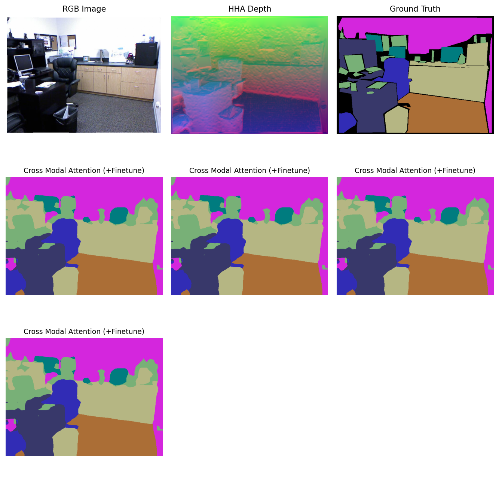
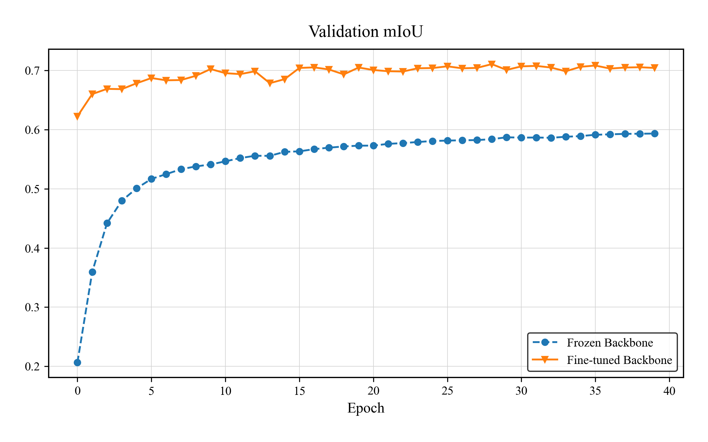
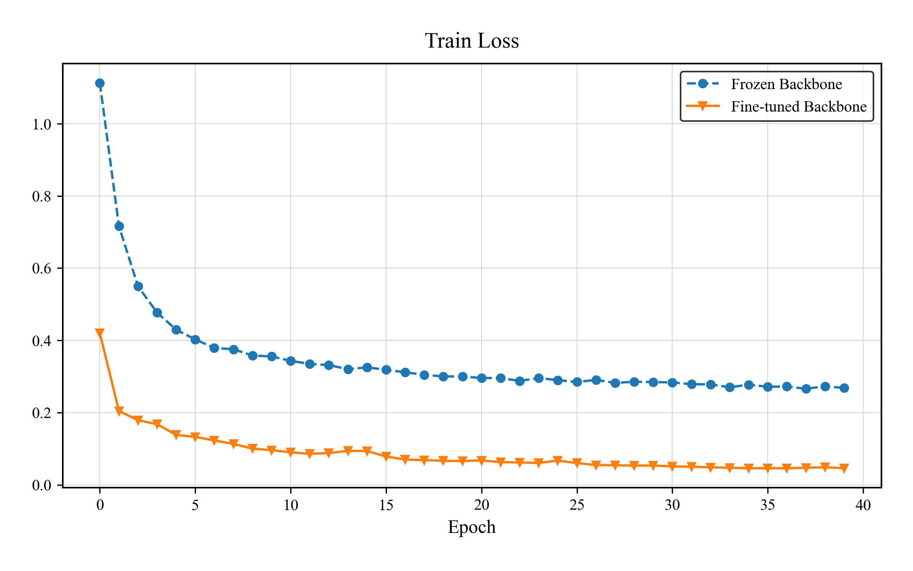
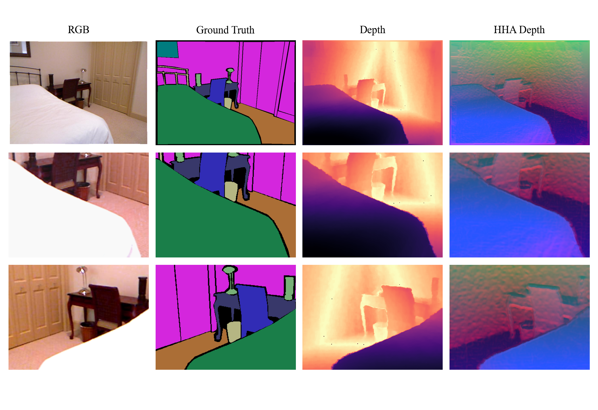

# RGBD-Align

**RGB + Depth, best friends for semantic segmentation.**

RGBD-Align is a PyTorch project that explores RGB-D fusion for semantic
segmentation on NYUv2. It includes baselines (U-Net variants) and DINOv2-based
fusion models, plus utilities for HHA depth encoding, visualization, and
training metrics.

## Highlights
- Multiple RGB-D fusion styles: early/mid fusion, cross-modal attention, adapters
- NYUv2 dataset wrapper and optional HHA depth encoding
- Config-driven training with repeatable experiments
- Visualization tools for side-by-side qualitative comparisons

## Quickstart
1. Create a Python environment with PyTorch + torchvision.
2. Install the local dataset helpers:
   ~~~bash
   ./install.sh
   ~~~
3. Train a baseline model:
   ~~~bash
   python src/train.py --config src/config/example_config.yaml
   ~~~

## Data
NYUv2 downloads are handled by the local dataset wrapper. See
`src/data/pytorch_nyuv2/README.md` for dataset sources and details.

The dataset layout expected by the configs is documented in
`src/config/example_config.yaml`.

## Configuration
Training is driven by YAML files in `src/config/`. Examples:
- `src/config/example_config.yaml`: U-Net baseline on NYUv2
- `src/config/dinov2_conf_*`: DINOv2-based fusion variants

## Training (local or cluster)
Local:
~~~bash
python src/train.py --config src/config/dinov2_conf_fine_tuned.yaml
~~~

Cluster (SLURM):
~~~bash
sbatch scripts/train_dino.sh
~~~

## Visualization
Create side-by-side qualitative comparisons:
~~~bash
python src/view_seg_result.py -c src/config/gen_results.yaml -i 0 -o out.png
~~~

## Results & Plots
Training curves and summaries live in `results/plots/`.

## Repository layout
- `src/`: models, training, data pipeline, metrics
- `scripts/`: SLURM training scripts
- `results/`: plots and checkpoints
- `doc/`: project report and proposal

## Acknowledgements
- NYUv2 dataset and metadata (see `src/data/pytorch_nyuv2/README.md`)
- Depth2HHA implementation in `src/data/Depth2HHA-python`
- DINOv2 for RGB-D fusion experiments
